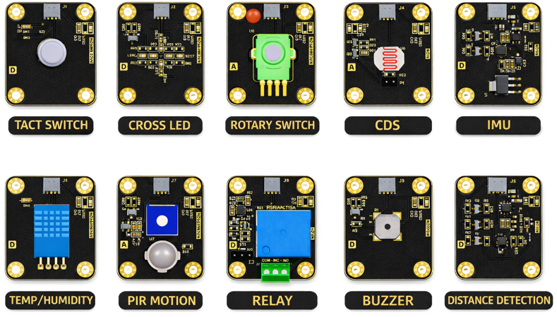
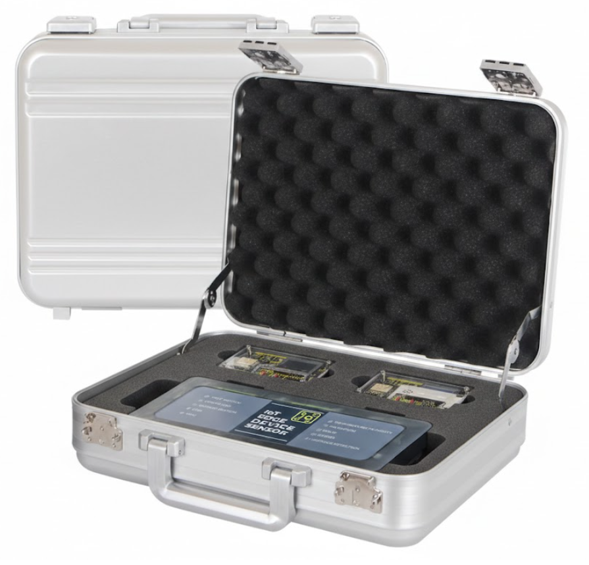

# BRICKS-ESP32: Intelligent IoT Edge Device  
> **AIoT 교육 및 프로토타이핑을 위한 All-in-One 개발 플랫폼**

---

## 🌟 Introduction | 제품 소개  
**BRICKS-ESP32**는 **AxisFab**에서 개발한 **지능형 IoT Edge Device**로,  
고등학교 및 대학교 교육과 빠른 프로토타이핑을 위한 **통합형 AIoT 플랫폼**입니다.

고성능 **ESP32-S3** 기반으로 설계되어,  
센서 데이터 수집 → 로컬 처리 → 시각화 → 무선 통신까지  
**하나의 디바이스에서 모두 구현 가능한 All-in-One 시스템**입니다.

---

## 🚀 Key Features | 주요 특징  
* **All-in-One AIoT Platform**  
  → 센서, 디스플레이, 통신이 통합된 온디바이스 AIoT 솔루션  

* **High-Performance MCU (ESP32-S3)**  
  → Edge AI 및 실시간 데이터 처리에 최적화  

* **Integrated Interface Design**  
  → MEMS 센서 및 다양한 인터페이스(GPIO, I2C, SPI 등) 내장  

* **Education & Prototyping Ready**  
  → 교육용 실습 + 산업용 시제품 개발까지 모두 대응  

---

## 🛠 Hardware Specifications | 하드웨어 사양  
**BRICKS-ESP32**는 **Smart Home / Smart Farm 환경**에 최적화된  
통합형 IoT Edge Device입니다.

| Feature | Specification | 설명 |
| :--- | :--- | :--- |
| **Main MCU** | ESP32-S3 (Dual-core LX7) | 고성능 IoT SoC |
| **MEMS Sensor** | SHTC3, ICS-43434 Mic | 온습도 + 음성 입력 |
| **Wi-Fi** | 802.11 b/g/n (2.4GHz) | 무선 네트워크 |
| **Bluetooth** | BLE 5.0 | 저전력 통신 |
| **Display** | 0.96" OLED (128x64) | 상태 시각화 |
| **Extension I/F** | GPIO, ADC, I2C, SPI, UART | 확장 인터페이스 |
| **Power** | 5V USB Type-C | 전원 및 디버깅 |

---

## 🧠 IoT Core Processor | ESP32-S3  

본 키트는 **ESP32-S3-WROOM-1** 기반으로 동작하며,  
AIoT 실습에 최적화된 성능을 제공합니다.

### Technical Highlights
* **Dual-core Xtensa LX7 CPU**  
* **Up to 16MB Flash / PSRAM 지원**  
* **Wi-Fi + Bluetooth 5 (LE)**  
* **AI Acceleration (Vector Instructions)**  
* **45 GPIO & 다양한 Peripheral 지원**  
* **보안 기능 (Secure Boot, Flash Encryption)**  

---

## 🔧 IoT Sensor Kit (10 Types) | 센서 키트 구성  

다양한 IoT 실습을 위한 **10종 센서 모듈 세트**

### ✨ Features
* Digital / Analog / I2C 센서 통합 구성  
* 3.3V ~ 5V 호환 (ESP32, Arduino, Raspberry Pi)  
* 3핀 구조 (VCC / SIG / GND) → 쉬운 연결  

---

## 📊 Sensor List | 센서 구성

| Sensor | Type | Function |
| :--- | :--- | :--- |
| Tact Switch | Digital Input | 사용자 입력 |
| Cross LED | Digital Output | 상태 표시 |
| Rotary Switch | Analog Input | 단계 선택 |
| CDS Sensor | Analog | 조도 감지 |
| IMU (ICM-20948) | I2C | 자세/가속도 |
| Temp/Humidity | Digital | 환경 측정 |
| PIR Motion | Digital | 움직임 감지 |
| Relay | Digital Output | 전원 제어 |
| Buzzer | Digital Output | 알림 |
| ToF Distance | I2C | 거리 측정 |

---

## 🧩 Learning & Interaction | 학습 요소  

### 🎮 Input / Output  
* Tact Switch, Rotary → 사용자 인터랙션  
* LED, Buzzer → 피드백 시스템  

### 🌍 Environment Sensing  
* 온습도, 조도, 모션 센서 기반 스마트 환경 구현  

### 🤖 Smart Control  
* Relay + Distance Sensor → 자동화 시스템 구현  

---

## 📦 Kit Contents | 구성품  

* **2x BRICKS-ESP32 Device**  
* **10x Sensor Modules**  
* **1x Servo Motor (MG90D)**  
* **2x USB Cable (Type-C)**  
* **교육용 교재 (IoT & Cloud 실습)**  
* **센서 보관 케이스 + 알루미늄 캐리어**  

### 🎒 Carrying Case
* TSA Lock 적용  
* Size: 38 × 28 × 12 cm  

---

## 🎯 Target Applications | 활용 분야  
* 스마트홈 (Smart Home)  
* 스마트팜 (Smart Farm)  
* AIoT 교육 (High School / University)  
* 임베디드 시스템 실습  
* 프로토타입 개발 (Rapid Prototyping)  

---

© 2026 AxisFab by Leekoos. All rights reserved.
